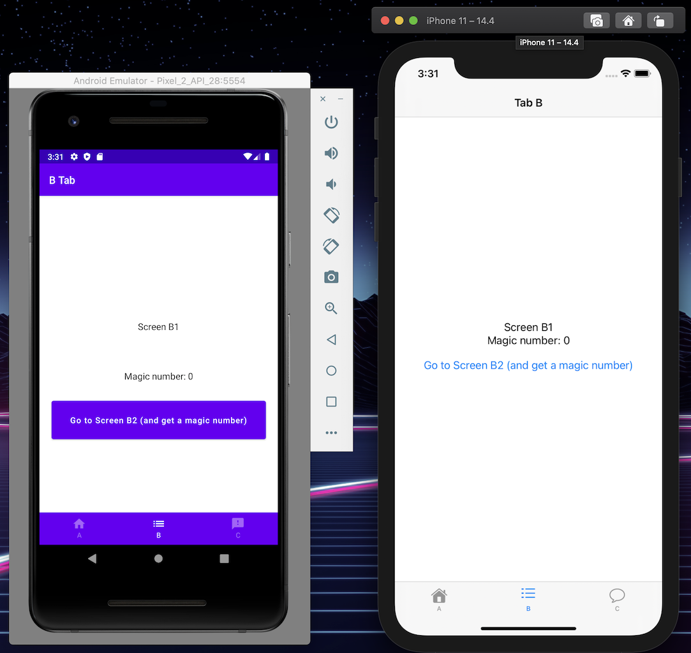

# Decompose KMM Navigation Sample

This demo app is an example of how we can use [Decompose](https://arkivanov.github.io/Decompose/getting-started/) to build a KMM / bottom navigation based app. 

The behavior should be similar to the example created by the Android team as seen in this [Navigation Advanced Sample](https://github.com/android/architecture-components-samples/tree/master/NavigationAdvancedSample) which is part of the Android Architecture samples.


## Implementation notes

All `Components` lives in the shared library. A Jetpack Compose implementation is available for Android and a SwiftUI implementation is available for iOS.

### Component tree
The current [Component](https://arkivanov.github.io/Decompose/component/overview/) structure is ordered like this:

```
          Root      
           |      
          Main (BottomNav lives here)      
       /   |   \
     /     |     \
   A       B       C 
  / \     / \     / \
A1   A2 B1   B2 C1   C2
```

The main reason why `Root` and `Main` are separate components, is because often you would like to add things like a `Landing` or `Login` screen. In that case you would structure the components like this:  

```
           Root  
       /    |     \
Landing   Login     Main
                  /    |   \
                 /     |    \     
                /      |     \
               A       B      C 
              / \     / \     / \
            A1   A2 B1   B2 C1   C2
```

### Components
* The `RootComponent` handles navigation to the `MainComponent` by using a [router](https://arkivanov.github.io/Decompose/router/overview/)
* The `MainComponent` is where the bottom navigation is implemented and is responsible for switching between the tabs. It as well has its own router.
* Each tab (`A`, `B` and `C`) has its own router. This is done so that we can remember which (child) component is active when we switch between the different tabs.
* This also means that `Component A` is the only one that is aware of its children (`Component A1` and `Component A2`). The `MainComponent` only switches between component `A`, `B` and `C`.
* The magic that make the bottom nav work is this piece of code from [Arkadii Ivanov](https://github.com/arkivanov/Decompose/discussions/178#discussioncomment-1005820). Currently provided as a [separate function](https://github.com/falcon4ever/KMM-demos/blob/main/DecomposeNavigationSample/app/src/main/java/com/epicwindmill/navigationsample/utils/DecomposeExt.kt) but hopefully at some point part of Decompose.

#### Extra
* Tab B, C shows an example how you can return a value back to the previous screen

## Build env
This demo was created using Android Studio Arctic Fox 2020.3.1 / XCode 12.4

## Demo

