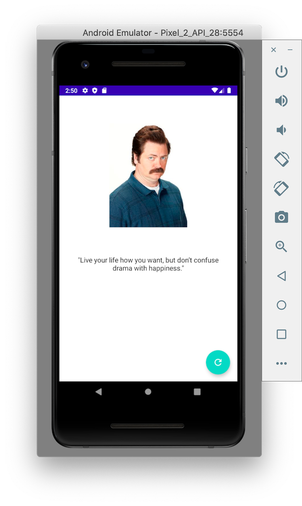

# Decompose/MVIKotlin/Ktor KMM Sample

This demo app is an example of how we can use [Decompose](https://arkivanov.github.io/Decompose/getting-started/), [MVIKotlin](https://arkivanov.github.io/MVIKotlin/) and [Ktor](https://ktor.io/) to build a KMM based app. 

## Implementation notes

The demo implements Decompose `components`, a MVIKotlin `Store` and uses `ktor` to fetch random Ron Swanson quotes.

## Build env
This demo was created using Android Studio Arctic Fox 2020.3.1 Beta 5. 
<<<<<<< HEAD

## Demo

